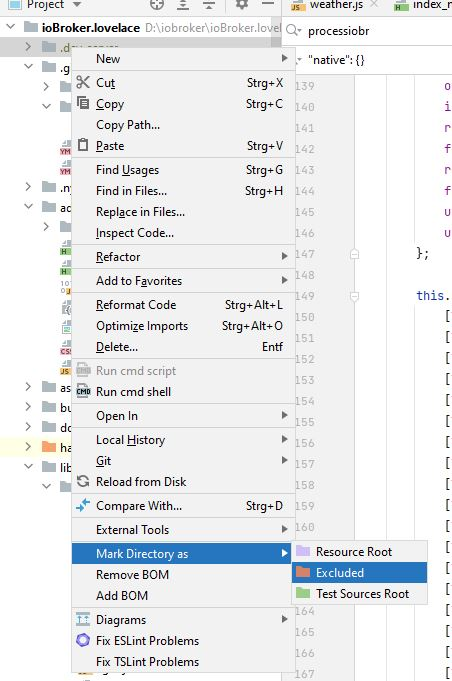
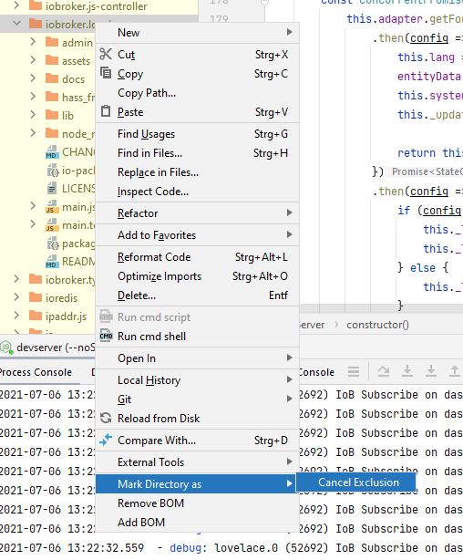
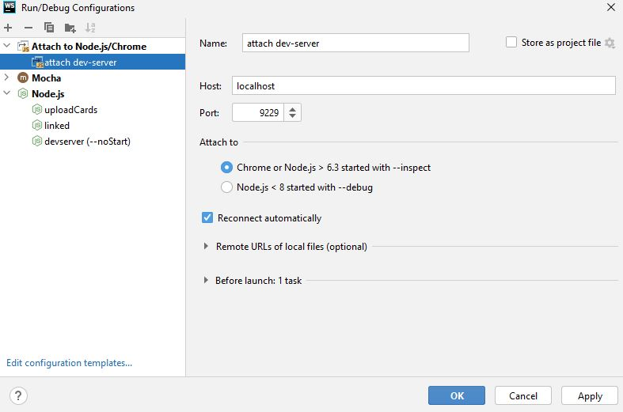
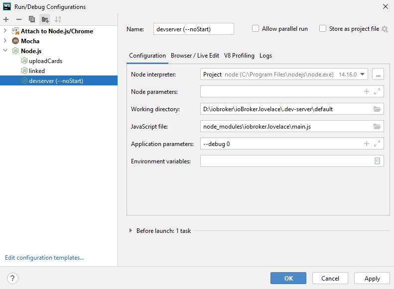

# ioBroker dev-server

[](https://www.npmjs.com/package/@iobroker/dev-server)
[](https://www.npmjs.com/package/@iobroker/dev-server)

ioBroker dev-server is a simple command line tool running on Windows, Linux and macOS that allows you to quickly develop and test ioBroker adapters and their admin interface.

> [!NOTE]
> dev-server requires at least Node.js 14.

## Installation

```bash
npm install --global @iobroker/dev-server
dev-server setup
dev-server watch
```
(a local installation as dev-dependency is also possible)

> [!TIP]
> If the `dev-server` command is not found **under Windows**, check that the npm directory (typically `C:\Users\%username%\AppData\Roaming\npm`) is included in the `PATH` variable.

## Features

- Runs on all operating systems supported by Node.js and ioBroker
- Support for HTML and React UI
- Support for JavaScript and TypeScript adapters
- Hot reload of Admin UI upon any changes to HTML and JavaScript files.
- Hot reload of adapter upon code changes
- Live log in the console
- Debug adapter during start-up
- Multiple "profiles" allow for different datasets
- Multiple instances of dev-server can run in parallel (using different ports)
- All ports are only available locally (127.0.0.1)
- Easy integration in your preferred IDE

### Debugging ioBroker.js-controller

It is possible to run `dev-server` in the root directory of your local copy of [ioBroker.js-controller](https://github.com/ioBroker/ioBroker.js-controller/). This way you can debug and work on js-controller itself; `watch`, `debug` and `debug --wait` are all supported.

## Setup

You need to install the `dev-server` package as well as set it up it in the adapter directory.

### Install package
*Before installing, please check the following what is the best way or recommended:*


#### Linux
* install it as a dev-dependency of your adapter (recommended)
* install this tool as a global tool

Under Linux, it is sometimes useful to install this tool as global, BUT best practice for developing an own adapter it is better to install it as dev-dependency

#### MacOS
* Under macOS, be careful with installation as global. This is not recommended so better to install it as a dev-dependency

#### Windows

* Under Windows, a global installation is no problem.

> [!NOTE]
> dev-server requires at least Node.js 14.

How to install it globally:

```bash
npm install --global @iobroker/dev-server
```

#### Installation as a development dependency

Some more explanation, especially when a **global installation** is problematic **because of permission** issues (e.g., on **macOS**), you can add the dev-server to your adapter's `devDependencies` and add it e.g., as a script to your package.json.

```json
{
  "devDependencies": {
    "@iobroker/dev-server": "^x.x.x"
  },
  "scripts": {
    "dev-server": "dev-server"
  }
}
```

then you can run it via `npm run dev-server`.

### Setup local dev-server

To set up and configure a local dev-server in your adapter directory, change to the **base directory of your adapter** and execute the following command:

```bash
dev-server setup
```

For additional command line arguments, see below.

> [!NOTE]
> The executable can either be called with the short name `dev-server` or its full name `iobroker-dev-server`. We will use the first way in this document.

### Exclude temporary folder

By default, dev-server creates a temporary directory called `.dev-server` in your adapter directory where all data is stored. This directory must be excluded from NPM and Git.

Your `.gitignore` file must be extended with a single additional line:

```text
.dev-server/
```

If you created your adapter using a recent version of [Adapter Creator](https://github.com/ioBroker/create-adapter), the `.nmpignore` file will already contain a pattern matching this folder, otherwise add the above line or simply ignore all "dot"-files and folders:

```text
.*
```

## Command line

Usage: `dev-server <command> [options] [profile]`

All long-running commands can be stopped using `Ctrl-C`.

The following global options are available for all commands:

`--temp <path>` Change the temporary directory where the dev-server data will be located (default: ".dev-server").

### Profiles

All commands (except of course `dev-server profile`) support the `[profile]` command line argument. It allows the user to choose between different profiles.

Each profile is a completely independent instance of ioBroker and can run in parallel with other profiles of the same adapter (if different ports are configured).

If no profile is specified on the command line, dev-server will do the following:

- if only one profile exists, it will be used
- if no profile exists, a profile called `default` will be created (only valid for `dev-server setup`)
- if multiple profiles exist, the user has to choose one from a list

### `dev-server setup`

Set up dev-server in the current directory. This should always be called in the directory where the `io-package.json` file of your adapter is located.

The following options are available:

`--adminPort <number>` TCP port on which `ioBroker.admin` will be available (default: 8081). This port number is also used to generate all other port numbers required to run dev-server. This allows multiple instances of dev-server to run in parallel. It is suggested to use ports in the range of 8000-9999. If you experience connection problems, try a different port.

`--jsController <version>` Define which version of js-controller to be used (default: "latest").

`--admin <version>` Define which version of admin to be used (default: "latest").

`--backupFile <filename>` Provide an ioBroker backup file to restore in this dev-server. Use this option to populate the dev-server with data (and possibly other adapters).

`--symlinks` Use symlinks instead of packing and installing the current adapter for a smoother dev experience. Requires JS-Controller 5+.

### `dev-server run`

Run dev-server, the adapter will not run, but you may test the Admin UI with hot-reload.

If you start the adapter from Admin, be aware that it will use the code uploaded during setup (or when `dev-server upload` was called explicitly).

### `dev-server watch`

Run dev-server and start the adapter in "watch" mode.

The adapter will automatically restart when its source code changes (with a 2-seconds delay).

> [!IMPORTANT] 
> **DO NOT** start the adapter manually in `ioBroker.admin`! If you see errors like `ADAPTER_ALREADY_RUNNING` then most likely you ignored this info :-)

You may attach a debugger to the running adapter. Keep in mind that the debugger will be detached when you change your source code, you need to manually attach again to the new process. Watch the console output for the correct process id to attach to.

If you are using TypeScript, make sure you have the `watch:ts` script defined the same way it is done by [Adapter Creator](https://github.com/ioBroker/create-adapter). There is no need to run `npm run watch:ts` separately, this is automatically done by dev-server.

The following options are available:

`--noStart` Do not start the adapter itself, but only watch for changes and synchronize them between the development and the temporary directory.

`--noInstall` Do not build and install the adapter before starting dev-server.

`--doNotWatch <filepattern>` Provide files and locations relative to adapter base directory that should not be watched for changes. This option can be provided multiple times to ignore several locations.

### `dev-server debug`

Run dev-server and start the adapter from ioBroker in "debug" mode.

You may attach a debugger to the running adapter. Watch the console output for the correct process id to attach to.

The following options are available:

`--wait` Start the adapter only once the debugger is attached. This works the same way as calling `iobroker debug <adapter-name>.0 --wait` which in itself is similar to `node --inspect-brk ...`

`--noInstall` Do not build and install the adapter before starting dev-server.

### `dev-server update`

Update ioBroker and its dependencies to the latest versions.

If you specified `--jsController` during setup, the js-controller version will not be updated.

### `dev-server upload`

Upload the current version of your adapter to the dev-server.

This is only required if you changed something relevant in your io-package.json.

You should only do this when dev-server is not running.

This is a shortcut for `npm pack` and `npm install <package>.tgz`.

### `dev-server backup <filename>`

Create an ioBroker backup to the given file.

### `dev-server profile`

Lists all available profiles with their meta-data.

## IDEs

You can, of course, use dev-server together with your preferred IDE.

The following chapters all assume you have dev-server installed and set up correctly (see above).

### Visual Studio Code

Depending on your preferences, you can either start the adapter with dev-server and then attach your debugger or you can start dev-server and then launch the adapter from Visual Studio Code. Both setups are explained below.

#### Attach to dev-server

If you want dev-server to take care of the adapter by building (if needed), uploading, running and relaunching upon changes, start it from the built-in Terminal in Visual Studio Code:

```bash
dev-server watch
```

When the adapter is ready, you will see a message like the following:

```
╭──────────────────────────────────────────────────╮
│                                                  │
│   Debugger is now available on process id 1234   │
│                                                  │
╰──────────────────────────────────────────────────╯
```

You can now attach the Visual Studio Code debugger to the given process ID:

- Open the Command Palette (Ctrl-Shift-P)
- Choose "Debug: Attach to Node Process (legacy)"
- Select the right process, it usually looks like follows:

```
node  --inspect <path to your dev-server directory>/node_modules/...
process id: 1234, debug port: 9229
```

Now you can set breakpoints (or they are hit if you set them before) and inspect your adapter while running.

#### Launch adapter independently

If you want to launch the adapter from Visual Studio Code, start dev-server without the adapter from the built-in Terminal:

```bash
dev-server watch --noStart
```

When dev-server is ready, you will see a message like the following:

```
╭──────────────────────────────────────────────────────────────────────────╮
│                                                                          │
│   You can now start the adapter manually by running                      │
│       node node_modules/iobroker.<adapter>/<path-to-main.js> --debug 0   │
│   from within                                                            │
│       <your-project-root>/.dev-server/default                            │
│                                                                          │
╰──────────────────────────────────────────────────────────────────────────╯
```

Take note of the two paths and create (or extend) a file called `.vscode/launch.json`:

```json
{
  "version": "0.2.0",
  "configurations": [
    {
      "type": "node",
      "request": "launch",
      "name": "Launch ioBroker Adapter",
      "skipFiles": ["<node_internals>/**"],
      "args": ["--debug", "0"],
      "program": "node_modules/iobroker.<adapter>/<path-to-main.js>",
      "cwd": "${workspaceFolder}/.dev-server/default"
    }
  ]
}
```

You may now launch this configuration with "Start Debugging" (F5).

### WebStorm

Depending on your preferences, you can either start the adapter with dev-server and then attach your debugger, or you can start dev-server and then launch the adapter from WebStorm. Both setups are explained below.

In order to improve the performance of WebStorm, I recommend excluding the `.dev-server` directory from the context menu (see screenshot). This will prevent WebStorm from indexing the directory, which could take some time.



Now cancel the exclusion for the adapter directory in .dev-server\default\node_modules\ioBroker.ADAPTER like in the screenshot below. This is necessary to get breakpoints for the attached/debugged process working again.



#### Attach to dev-server

If you want dev-server to take care of the adapter by building (if needed), uploading, running and relaunching upon changes, start it from the built-in Terminal in WebStorm:

```bash
dev-server watch
```

Set up a launch configuration to attach to the process like this:



When the adapter is ready, you will see a message like the following:

```
╭──────────────────────────────────────────────────╮
│                                                  │
│   Debugger is now available on process id 1234   │
│                                                  │
╰──────────────────────────────────────────────────╯
```

You can now start the `attach` configuration and use the debugger console as usual.

#### Launch adapter independently

If you want to launch the adapter from Visual Studio Code, start dev-server without the adapter from the built-in Terminal:

```bash
dev-server watch --noStart
```

When dev-server is ready, you will see a message like the following:

```
╭──────────────────────────────────────────────────────────────────────────╮
│                                                                          │
│   You can now start the adapter manually by running                      │
│       node node_modules/iobroker.<adapter>/<path-to-main.js> --debug 0   │
│   from within                                                            │
│       <your-project-root>/.dev-server/default                            │
│                                                                          │
╰──────────────────────────────────────────────────────────────────────────╯
```

Take note of the paths and set up a launch configuration like in the screenshot below:



Now you can run / debug and restart the process from WebStorm, and changes will automatically be synced.
